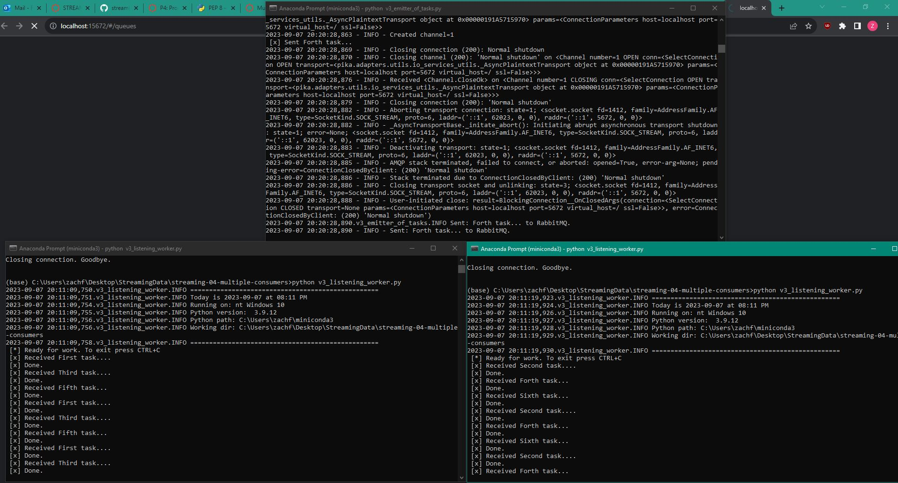
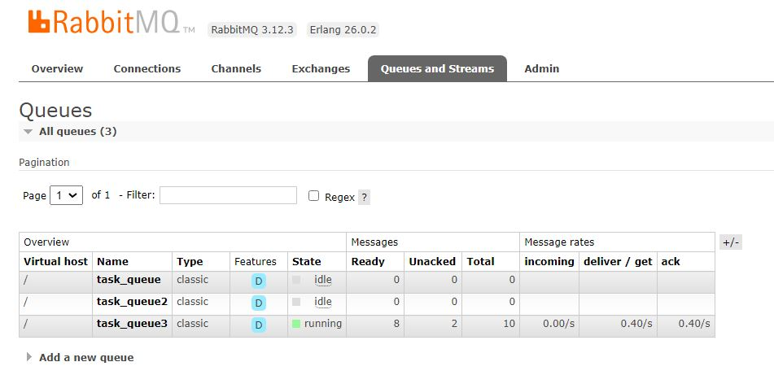

# streaming-04-multiple-consumers

> Use RabbitMQ to distribute tasks to multiple workers

One process will create task messages. Multiple worker processes will share the work. 

## Before You Begin

1. Fork this starter repo into your GitHub.
1. Clone your repo down to your machine.
1. View / Command Palette - then Python: Select Interpreter
1. Select your conda environment. 

## Read

1. Read the [RabbitMQ Tutorial - Work Queues](https://www.rabbitmq.com/tutorials/tutorial-two-python.html)
1. Read the code and comments in this repo.

## RabbitMQ Admin 

RabbitMQ comes with an admin panel. When you run the task emitter, reply y to open it. 

(Python makes it easy to open a web page - see the code to learn how.)

## Execute the Producer

1. Run emitter_of_tasks.py (say y to monitor RabbitMQ queues)

Explore the RabbitMQ website.

** When running v1_emmitter_of_tasks.py, the webpage that it tries to open does not load. Is this supposed to happen?

## Execute a Consumer / Worker

1. Run listening_worker.py

Will it terminate on its own? How do you know? 

** It will not terminate on its own. CTRL+C is the command to exit this process, as has been the case in previous assignments. The doc-string in the top of the file also alerts us to this. The task itself will be completed (marked as Done) based on how many .s are in the message. More of these will mean the task will take longer to be completed.

## Ready for Work

1. Use your emitter_of_tasks to produce more task messages.

** It seems that if we lengthen the time the message takes to finish by add more .s, we can rapidly send several messages back to back, meaning which terminal/consumer that receives the message will change to balance the load.

## Start Another Listening Worker 

1. Use your listening_worker.py script to launch a second worker. 

Follow the tutorial. 
Add multiple tasks (e.g. First message, Second message, etc.)
How are tasks distributed? ** If one listener/terminal is busy, the tasks will be sent to the other listerner.
Monitor the windows with at least two workers. 
Which worker gets which tasks? ** Which worker gets which task depends on whether a work is currently working on a task. If it does, it will send it to the other open worker. If there is no other open worker, it will wait for the queue to clear in the current worker/terminal.

## Notes
In version 2, it is easier to change the queue name, the host machine, and the message sent, as these are stored in variables and passed as arguments to the functions that run in the "if name == __main__" portion of each file. We can simply go to these variables and change their values to change the queue name, the host machine, and the message sent.

For a few hours, I wasn't able to get the RabbitMQ Admin Site to open. I thought there was a problem with my install of RabbitMQ, but it was very difficult to diagnose. It didn't seem to effect my ability to use Pika and complete this assignment.

Update 9/8/2023: After doing a bit more research and a restart, it seems to be working now! I believe the issue had something to do with setting path variables for RabbitMQ and Erlang on my Windows system, but I can't say for certain as I tried several fixes. One important note is that I was prompted for a username and password to access the RabbitMQ admin site. For this purpose, "guest" was sufficient for both the username and password.

I tried using the time.sleep() function from module 2 in addition to the multiple . method we used in this section, but it appears that time.sleep() overrides our . timing logic, so I removed that one.

Getting the new emitter file (V3) wasn't too difficult, as it was mostly mixing a few elements of Module 2 and this module. I did have to reference Google for a few things, and GPT helped me format my code better than I had originally.

## Reference

- [RabbitMQ Tutorial - Work Queues](https://www.rabbitmq.com/tutorials/tutorial-two-python.html)

## Screenshot

See a running example with at least 3 concurrent process windows here:

